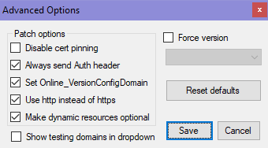

# HITMAPS™ Roulette Launcher

 
_Custom Steam Art header image._

 

## Description

Launcher for HITMAPS™ In-Game Roulette.

Runs as a background process, launching both HITMAN 3 and LocalGhost's Hitman2Patcher.

Written in AutoHotkey.

It is NOT affiliated with HITMAPS™ or LocalGhost.

 

## Launcher Instructions

1. Download the "HITMAPS™ Roulette Launcher" release from: 
https://github.com/tuglaw/HITMAPS-Roulette-Launcher/releases/latest

2. Download the latest LocalGhost’s "Hitman2Patcher" from: 
https://gitlab.com/grappigegovert/localghost/-/jobs/artifacts/master/download?job=build_patcher

3. Extract the "Roulette" folder into the root of the "HITMAN3" folder.

4. Place "Hitman2Patcher.exe" inside the "Roulette" folder.

5. (Optional) Create a shortcut for "Roulette.exe".

 

## Setting Up Hitman2Patcher

1. Choose "gm.hitmaps.com - Eastern US" from the "Server address" dropdown list.

2. Configure "Advanced Options" with the following settings:  

3. Save your changes and close "Hitman2Patcher". You can now start the game with "Roulette.exe".

 

## Custom Steam Art Credits

HITMAPS™ Roulette logo and icon by MrMike.
https://www.hitmaps.com/

Roulette photos by Anna Shvets.
https://www.pexels.com/@shvetsa

 
